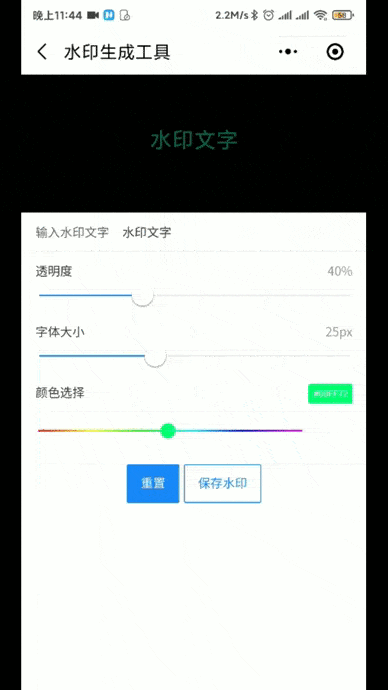

# sliderColorPick
 组件为微信小程序->滑动颜色选择器


  ## 组件演示
  
  
  <br/>
  
  <br/>
  
  <br/>
  


  <br/>
  <br/>
  <br/>

  ## 扫描下面小程序码，体验组件

  


组件属性
~~~
必须设置 
lineLength 色带的长度  建议 300
sliderBtn  滑动按钮的大小 建议 12
~~~

  当前为初期版本后续会继续更新

  demo 接入方式  
  ``` json
index.json
{
 "usingComponents": {
   "slider-color-picker":"../../components/sliderColorPicker/sliderColorPicker"
  }
}   
```
  ``` html
index.html
    <slider-color-picker bindmoveSlider="sliderColor" lineLength = "300" sliderBtn="12"></slider-color-picker>


  ```

``` javaScript
index.js

 sliderColor(e) {
    this.setData({
      color:e.detail
    })
  }

```

